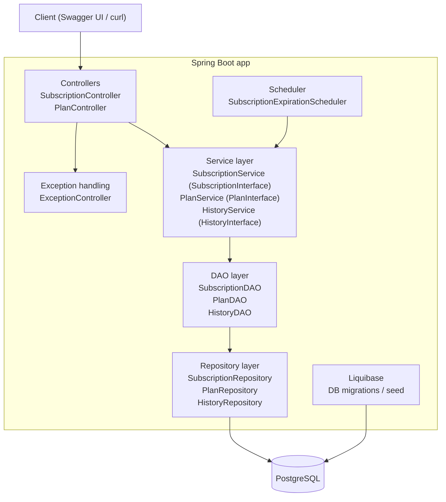
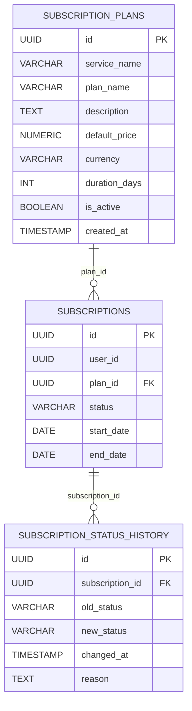

# Запуск

## Через Docker Compose

Собрать и поднять сервисы:

```bash
docker compose up --build
```

- Приложение: `http://localhost:8080`
- Swagger UI: `http://localhost:8080/swagger-ui.html`

## Локально (без Docker для приложения)

1) Поднять PostgreSQL:

```bash
docker compose up -d postgres
```

2) Запустить приложение:

```bash
./mvnw spring-boot:run
```

Конфигурация подключения к PostgreSQL по умолчанию находится в `src/main/resources/application.properties`.

## Запуск тестов

```bash
./mvnw test
```

# Архитектура проекта



# База данных

Схема управляется Liquibase (см. `src/main/resources/db/changelog/*`).



# Варианты улучшения системы

- Добавить Bean Validation (`spring-boot-starter-validation`) и аннотации в DTO для валидации входных данных.
- Добавить авторизацию (например, JWT) и ограничение доступа к данным по пользователю, также добавить систему учета пользователей
- Добавить кэширование часто запрашиваемых данных
